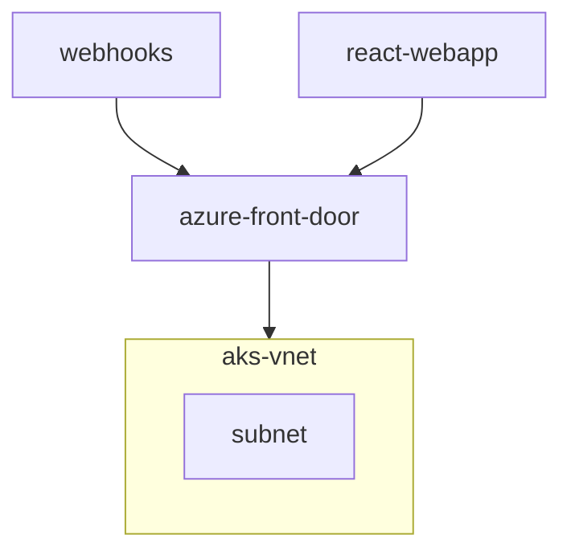
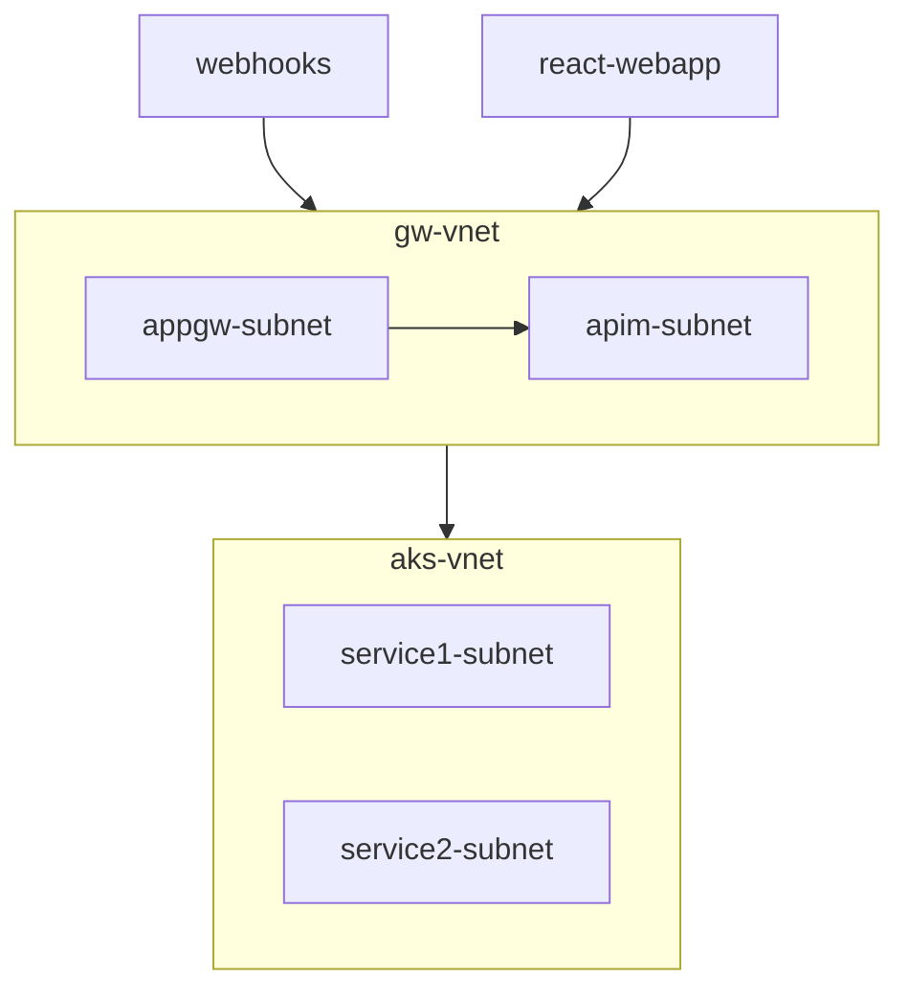

# Requirements

- React web app, a Single Page Application.

- Backend service #1, which wraps the banking provider:
    - Has its own database.
    - Accepts webhooks from the core banking system.
    - Provides an API that is only available internally within the solution.
    - This service should not be able to connect outbound to the public internet (except the IP range of the core banking system, `203.0.113.0/24`).

- Backend service #2, which implements an API for the React web app to consume:
    - Has its own database.
    - Provides an API that is available externally (rate limited to `10rps`).
    - Service can freely connect outbound to the public internet.
---

**Design:**

The design can be approached in multiple ways, depends on cost considerations and security requirements, ensuring an optimal and secure solution.

## 1. Azure Front Door -> AKS


**React Web App:**
- Deploy as a static web app and expose via Azure Front Door (AFD).

**Azure Front Door:**
- Configure domains for `webhooks-api` and `react-api`.
- Add WAF rules for IP filtering and rate limiting based on host headers.
- Set AKS services as backends.

**AKS:**
- Deploy backend services with internal ingress.
- Use Azure Private Link for AFD connectivity.
- Enforce outbound IP filtering using either:
    - Calico network policies, or
    - Dedicated subnets with NSG rules.

**Databases:**
- Place databases in separate VNets with private endpoints for secure access.

**Alternative:**
- Replace AFD with Application Gateway (WAF_v2) if needed.
---

## 2. APPGW -> APIM -> AKS


**AppGw(Standard tier):**
- Configure two listeners with APIM as the backend.

**APIM:**
- Deploy in Internal mode with VNet integration.
- Expose APIs for both services.
- Apply `10rps` rate-limiting for Service #2.
- Use IP filtering for Service #1 via x-forwarded-for headers.

**AKS:**
- Add a dedicated node pool and subnet for Service #1.
- Enforce outbound IP filtering using subnet NSG.
---

# Terraform

- Use Azure storage for state files.
- Set up GitHub Actions with Azure federated credentials.
- Assign necessary permissions to the app registration.
- Organize resources into modular structures (e.g., rg, aks, vnet).
- Create environment-specific folders with main bicep files.
- Pass variables to modules for environment creation.
- Configure backend and use locals for environment-specific values.
- Use dependabot for updating the provider versions.

Sample directory tree look like,
```plaintext
terraform/
├── modules/
│   ├── aks/
│   │   ├── main.tf
│   │   ├── variables.tf
│   │   ├── outputs.tf
│   │   └── README.md
│   ├── vnet/
│   │   ├── main.tf
│   │   ├── variables.tf
│   │   ├── outputs.tf
│   │   └── README.md
│   ├── rg/
│   │   ├── main.tf
│   │   ├── variables.tf
│   │   ├── outputs.tf
│   │   └── README.md
│   └── database/
│       ├── main.tf
│       ├── variables.tf
│       ├── outputs.tf
│       └── README.md
├── dev/
│   ├── main.bicep
│   ├── backend.tf
│   ├── locals.tf
│   └── outputs.tf
└── README.md
```
---
# CI/CD Pipeline

- Separate CI/CD workflows per environment
- CI: Runs on every pull request – runs terraform init, validate, fmt, and plan.
- CD: Runs on push to main – includes apply step.
- Uses concurrency to prevent multiple Terraform runs at once (avoids state lock issues).
- Repo checkout + Terraform setup included in all runs.
- Optional: Post terraform plan output as a comment on the PR

---
